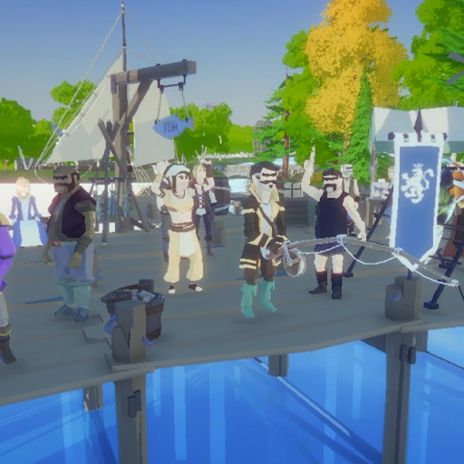
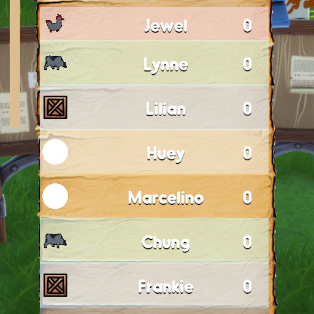
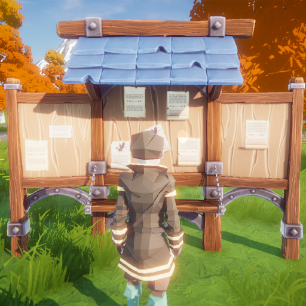
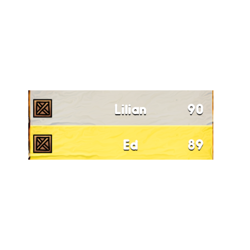
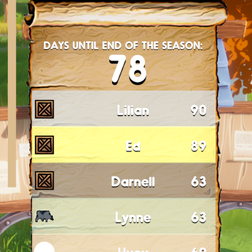


If you haven't already, [WISHLIST](https://store.steampowered.com/app/2749370/Fishermans_Palace/) the game on steam.


Hello everyone, hope You are doing wonderfully. Today we have a brand new update on our leaderboards. 

Currently the plan is to have the leaderboards automatically update each day on the amount of points each contestant has gathered throughout the day.

Each contestant has it's own skill level in fishing and in tournaments, and apart from that, is the form. His form can influence his skill, thus making the competition
more fierce, changing and challenging.

You as a player can take advantage of this with the correct strategy and planning, and obviously good fishing.

Here is the current timeline of the Leaderboard mechanic.




Implement the TEST leaderboard ui and import 10 random contestants, each with it's own unique name, faction and skill level.

  




Add a TEST faction color, a TEST badge to each individual contestant.

  




Now figure out the algorithm for having the player generate points(for obvious purposes i will not be explaining that any further :)

  




Make it so that when the season ends, there's a huge crowd crowning the winners, the top 3 will get all of the accolades, while the rest will have to try harder next season!

  




Apart from the usual celebrations full of crowds, and obviously rewards like coins and baits, fishing rods and what not, the top 3 contestants will receive
a custom name plate for that entire season.

  




That is currently what's been done, we have a lot of plans for the future (take this with the grain of salt.) 
but adding tournaments will be the next thing that needs to be done. Having contestants go once a week and compete against the player for some additional points, which can
increase your chances of becoming a champion!

But yes that is all I have for you this update, stay tuned for the main menu update, probably by the end of the week with some sneak pics from that as well. 


Thanks for reading!
